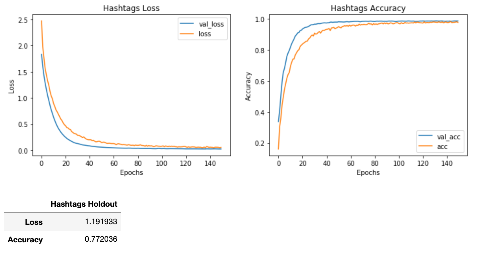

# Measuring Word of Mouth Marketing with NLP
## Sentiment Analysis and Product Recognition in Tweets

The objective of this project is to explore the numerous Natural Language Processing tools currently available to see what performs most effectively in attempting to do two things: 1) Extracting essential pieces of information from tweets and 2) determine the sentiment of these tweets. The business applications for these tools are endless, but the main focus of the project is to build a pipeline for processing large amounts of text data given a reasonable training dataset. Using these models, we can measure the impact of marketing campaigns on how much people are discussing certain products on social media and how they feel about them. While some people say all press is good press, negative word of mouth can be far more damaging than no market penetration at all. Also, tools like this can be used for gathering feedback on public perception of products and companies.

### The Data

The dataset is a collection of 9000 tweets all sent around the time of the SXSW festival regarding different products from Apple and Android, namely iPhones, iPads, Google Apps, and Apple Apps. Each tweet is tagged with the products the tweet concerns as well as 'Positive Emotion', 'Negative Emotion', 'No emotion', or 'I can't tell'. The tweets include non-ASCII characters as well as the usual quirks of social media communication. The data is extremely noisy because Twitter is a chaotic place. Some of the tweets aren't even in English, which is difficult to parse out without an effective language detector. Also, about half of the tweets have not been labeled with their correct product, so that data will not be included in the training/testing data for the entity recognition model.

### Approach

One of the challenges of NLP is deciding on both a vectorization method and how to clean the data before vectorization. There are several tools and methodologies available to approach both of these tasks. The core of Natural Language Processing is turning the text into tokens that can then be vectorized. To do this, we can either use basic REGEX extraction to find essential information, lemmatization, or we can use more advanced libraries of word embeddings such as SpaCy. For this project I will be using three vectorization methods:

    1) Bag of Words Count Vectorization
    2) Term Frequency - Inverse Document Frequency (TF-IDF) Vectorization
    3) SpaCy Doc pipeline vectorization
   
I expect there to be a large difference in the quality of these vectorization methods. Each tweet is, by definition, quite short and people tend to use punctuation and full sentences at random, which could make the SpaCy doc vectorization extremely noisy. For TF-IDF, I expect that to be more successful at identifying products, as it would make sense an iPad tweet would contain the word 'iPad' and not the word 'Google' more often than not.

### Preprocessing

However, before we vectorize, we must clean the data. Since these tweets are very noisy with special characters, websites, handles and image links, those will have to be removed. The two major choices after that would be concerning stop words (common words with no inherent entropic value) and hashtags.

In order to test the various models I created a TextSet class that will allow various preprocessing options. Hashtags are an interesting linguistic element of social media because they can be frustrating noise or they can be topic tags, meaning they are extremely useful OR extremely confounding. Take the fake tweet:

    This iPad's battery is great #justkidding #itsucks
    
Versus:

    This iPad's battery is great
 
In this case, removing the hashtags completely changes the meaning of the tweet. And so, for each of the vectorization methods, I will create one dataset without Hashtags and one with. The other major processing choice concerns stop words. The SpaCy vectorization method takes into account sentence structures and punctuation, so I will create two SpaCy datasets, one with hashtags and one without, while I will remove stop words from both the TF-IDF dataset and the Count Vectorized Dataset to measure their performance against one another.

### Model Comparison

I used several different multi-class classification models to solve these objects. In order to measure the accuracy of each model against all 4 datasets, I created the ModelComparison class that can produce key accuracy, precision, recall metrics for non-neural net models as well as validation and training loss charts for neural network machine learning models. I will be exploring the effectiveness of the following models on the various datasets:

- Gridsearch Support Vector Machine using 'rbf' and 'sigmoid' kernels
- Gridsearch polynomial kernal for a Support Vector Machine
- Gridsearch Random Forest Classifier
- Complement Naive Bayes (only on TF-IDF and Count vectorized models)
- Multinomial Naive Bayes (only on TF-IDF and Count vectorized models)
- Tensorflow Sequential Neural Network

## Product Entity Recognition: Baseline = 28.8% Accuracy
If we blindly guess iPad, we will be right 29% of the time. Below you can see the distribution of the tweets labeled by product. Any model we deploy must beat 29% to be considered effective.

## Sentiment Analysis: Baseline = 60.9% Accuracy

Below you can see the break down of each category into both number of entries in the dataset as well as relative frequencies.

Since there are so few 'I can't tell' tweets, I will fold those into the 'No emotion' class. This gives us a majority class of about 61%, so that's the number to beat.

## Preprocessing and Vectorization

As stated above, I will be comparing the performance of four different datasets on each of our possible classifiers.

- TF-IDF Vectorization with Hastags included
- SpaCy Doc2Vec Vectorization with Hashtags included
- SpaCy Doc2Vec Vectorization with Hashtags excluded
- Count Vectorization with Hashtags excluded

Since the Sentiment Analysis dataset is larger, we will tackle that objective first. As mentioned, we will combine both the 'I can't tell' and 'No Emotion toward brand or product' to give us a majority class of **60.9%**.

The various datasets have very different word clouds as you can see between this SpaCy word cloud and distribution (no hastags included) vs. the basic tokenization without SpaCy's Doc2Vec method (hashtags included):

Versus the basic tokenization with hastags kept in:

As you can see the frequency distributions and word clouds can differ greatly between datasets. You'll notice with the SpaCy datasets that there are multi-word phrases such as Apple Store. Also the hashtag #SXSW is used more than any other word, so removing hashtags massively alters the word distributions.

## Sentiment Analysis

Now that we have our datasets, we can feed them into our various models to compare how they do. First I will be comparing only test scores and then I will test holdout scores between the best models. Since the datatypes required for neural networks are fairly different from these other classifiers, I will compare those after tuning the non-neural networks to maximize accuracy.

### Non Neural Network Models

Here are the models we will be testing. Keep in mind, some of these cells take a lot time to run. I recommend skipping the random forest cells.

- Support Vector Machine Gridsearch
- Polynomial Support Vector Machine Gridsearch
- Random Forest
- Complement Naive Bayes
- Multinomial Naive Bayes

Ultimately the Support Vector Machine with the TF-IDF (hashtags included) dataset performed the best out of these models with a 69.1% accuracy on the holdout test set:

## Neural Network Models

First, I created a baseline model with 3 layers, each using the 'relu' activation method with a final output using the softmax activation to sort the values into 3 classes. I then tuned the model on the various datasets with more layers and introduced 30% dropout layers as well. Ultimately the best Neural Net model performed best on the TF-IDF vectorized dataset which included hashtags:

Once again, the TF-IDF with Hashtags data set reigns supreme. Notably, the model with the most layers and only a single dropout layer, nn_tfb_1, has the best accuracy compared to the other models.

## Best Models:

Ultimately, with some basic tuning, we managed to reach a holdout accuracy of about 69%, about an 8% increase over the baseline accuracy. This isn't ideal, but it is 8% better than a blind guess. The two models that had the best scores were:

- Neural Network with TF-IDF Plus Hashtags
- Support Vector Machine with TF-IDF Plus Hashtags

One very important thing to note is that both models are **underfit** which means the testing data is probably more uniform than the training data. With the chaotic nature of tweets, this makes sense and could be improved with deeper and more zealous preprocessing methods.

## Detecting the Products

In order to detect the products mentioned in the tweets, we will use the exact same methodology and process. There are some key differences:

- The training dataset is almost a third of the size of the Sentiment Analysis training data
- There is no category for 'No Product Mentioned'
- We can attempt to use string methods as well

I split the dataframe into labeled products and non-labeled products. Ultimately, we want to predict the products detected in the 5000+ tweets that have not been labeled yet.

### String Methods

There are a number of ways of extracting information using RegEx without using machine learning. Our baseline accuracy on this product problem is technically 29% (blindly guessing the majority class, which is 'iPad'). However, with even a basic decision tree function, I achieved 75% accuracy. This decision tree method would be almost useless in a production pipeline but it gives us a higher goal to hit. Therefore, the goal of modeling this problem is that beat 75%.

## Best Models

Using exactly the same process as the Sentiment Analysis, I created the same datasets to test the effectiveness of the available models and compared the results. Ultimately, the Support Vector Machine had the best accuracy, beating naive baseline 79.5% to 29% and beating string detection methods by 5%. Once again, every model is suprisingly underfit, meaning that our larger dataset is far noisier than our validation sets. The neural networks did fairly well, but ultimately, the Support Vector Machine was the most accurate model. Here are the results of the Neural Net model:

And here are the results of the SVM:

That said, the no hashtags dataset ultimately had the best precision scores on the holdout dataset, which is important to note based on the business use case for this model.

## Predicting Products

Now that we have a trained model, we can see if we can predict the products mentioned in the 5000+ unlabeled tweets. Keep in mind, there were no training examples of 'No Product' so the model will predict a product even if the tweet is utter nonsense. Below you can see the frequency of products in the 3500 labeled tweets versus the predicted frequency of products in the unlabeled tweets:

While the distributions are exactly the same, it certainly seems like reasonable results with a 79% accurate model.

# Conclusions

There are a number of conclusions that can be drawn from this process, but more than anything it opens up questions about next steps. Using tweets to measure Word of Mouth is fraught with challenges, but could be endlessly helpful. Twitter, as a platform, is meant to share short, quick responses to single items, meaning there is a lot to be gleaned from the Twitter population. The only medium that might be better at gauging fanbase sentiment would be Reddit.

## Vectorization Methods
It's clear why TF-IDF succeeded over SpaCy's arguably 'smarter' vectorization methods with this dataset. SpaCy is designed to read natural language in sentences, with correct parts of speech and punctuation. Unfortunately, Twitter is as kind to proper grammar rules as dynamite is to fine china. For tasks such as identifying entities, while SpaCy has an inherent Named Entity Recognizer built into its pipeline, that NER has to be trained on enough data to be effective. TF-IDF can identify those objects just by sheer token frequency, which makes sense. An iPad tweet will contain the word iPad and probably won't contain the word Samsung.

As for sentiment analysis, the differences weren't as massive. Sentiment is incredibly nuanced and, more often than not, subjective. In order to use natural language as training data, it must be tagged by a human and humans have all kinds of invisible biases.

Lastly, if we were to build a similar model for say Reddit or Facebook posts, there's a good chance that SpaCy would fare far better becasuse both of those platforms encourage long statements and are more conducive to self editing before posting. The immediate nature of Twitter makes it more noisy.

## Hashtags
This is specific to Twitter and any other Social Media platform that uses hashtags. In the end, the data that retained hashtags fared better on both tasks. This will be useful information for building any data pipelines in the future.

## Business Applications
There is no end to the usefulness of sentiment analysis. If this were to be transformed into a business-ready data pipeline (which I will discuss in a moment) it could be used to measure the aggregated effect of marketing campaigns on word of mouth, which, hopefully, would be a lead measure to an increase in sales. One could measure a baseline of interest in a brand before and after a product release to see how much the general public is engaging with your product. Coupled with Sentiment Analysis, a marketing team could build KPIs to understand their reach and how effective the product is, or if they need to create a new campaign to shift attention away from negative press. 

Alertnatively, these processing methods could be used to identify upticks in complaints about certain products or aspects of products. This could be instrumental to community engagement and feedback. I know from my own experience that video game companies rely heavily on the feedback posted on Twitter and Reddit to make changes to their games over time. A datapipeline like this could help reduce the workload on that department, increasing efficiency and help community managers respond to challenges and bugs far faster.

## Next Steps
There is a lot that can be done to improve this process, as with any NLP analysis. A language detector could be useful to reduce the tweets down to English only. Also, for the product recognition model, we have no 'No Product' tweets. In order to make this pipeline business ready, it would need to be trained on random tweets that do not mention any of the products we are identifying. 

Lastly, the datasets are still small, so in order to improve the model's effectiveness, it will require far more labeled data, which can be very costly in terms of implementation. That said, once the data is labeled, the TextSet and ModelComparison classes make model analysis and testing extremely efficient and can be applied to future pipelines using any manner of text-based medium.

Overall, with 69% accuracy on sentiment and 79% accuracy on product recognition, it's clear that these methods are successful on even the messiest of tweets. There are many directions these tools can go and it will be exciting to see how the field of Natural Language Processing evolves over the coming years.